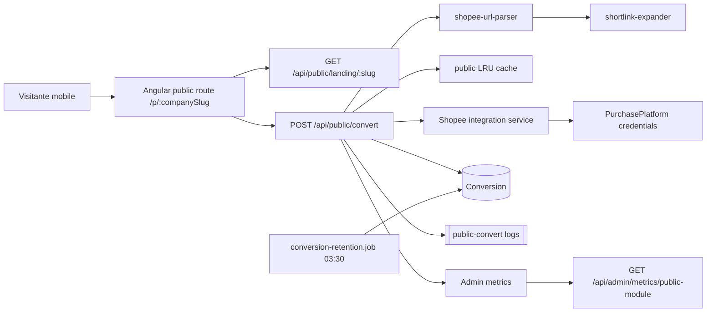

# Modulo publico Alli

O modulo publico Alli permite que uma empresa tenha uma landing sem login em `/p/<companySlug>` ou `/p/<companySlug>/<employeeSlug>`. O visitante cola uma URL Shopee longa ou shortlink (`shope.ee`, `br.shp.ee`, `s.shopee.com.br`), recebe um link afiliado e e redirecionado para a Shopee.

## Arquitetura



Componentes principais:

- Frontend publico: `come-pouco-frontend/src/app/public/`.
- Rotas publicas: `GET /api/public/landing/:slug`, `POST /api/public/convert`, `GET /api/public/healthz`.
- Orquestracao: `public-conversion.service.ts`.
- Validacao Shopee: `shopee-url-parser.service.ts`.
- Expansao de shortlink: `shortlink-expander.service.ts`.
- Cache: `cache/public.cache.ts`, com `lru-cache`.
- Retencao: `conversion-retention.job.ts`.
- Observabilidade admin: `GET /api/admin/metrics/public-module`.

## Onboarding de empresa nova

1. Criar ou validar a `Company`.
2. Vincular uma `PurchasePlatform` Shopee ativa em modo `TEST` ou `PROD`.
3. Definir o slug publico da empresa:
   - Admin/OWNER: `PUT /api/companies/:id/public-slug`
   - Body: `{ "publicSlug": "minha-loja" }`
4. Definir a URL de fallback:
   - Admin/OWNER: `PUT /api/companies/:id/fallback-url`
   - Body: `{ "fallbackAffiliateUrl": "https://shopee.com.br/product/..." }`
5. Configurar e ativar a landing:
   - Admin/OWNER: `PUT /api/companies/:id/landing-config`
   - Campos: `bannerText`, `bannerEmoji`, `heroTitle`, `heroSubtitle`, `howItWorksSteps`, `primaryColor`, `logoUrl`, `isActive`.
6. Configurar slugs de colaboradores quando houver atribuicao individual:
   - Admin/OWNER: `PUT /api/users/:id/public-slug`
7. Validar:
   - `GET /api/public/landing/<companySlug>` retorna 200.
   - Abrir `/p/<companySlug>` no frontend.
   - Fazer uma conversao mockada ou real conforme ambiente.

## Debug de conversoes

Use sempre o `X-Request-Id` da resposta ou dos logs para correlacionar eventos.

Pontos de verificacao:

- Browser: confirmar que `/api/public/landing/:slug` retorna 200 e que `/api/public/convert` retorna `success`, `fallback` ou `error`.
- Logs estruturados: filtrar pelo prefixo `[public-convert]` e campos `requestId`, `companySlug`, `employeeSlug`, `status`, `responseTimeMs`.
- Banco: consultar `conversions` por `id`, `company_id`, `employee_id`, `status`, `error_reason`, `mode`, `created_at`.
- Cache: `GET /api/admin/cache-stats` mostra hits/misses do cache publico.
- Metricas: `GET /api/admin/metrics/public-module` mostra cache hit ratio, conversoes por minuto, fallback ratio e contagens das ultimas 24h.
- Rate limit: respostas 429 em `/api/public/landing/:slug` ou `/api/public/convert` incluem headers `X-RateLimit-*`; hits relevantes entram no audit log.

Queries uteis:

```sql
SELECT id, company_id, employee_id, status, error_reason, mode, response_time_ms, created_at
FROM conversions
WHERE company_id = $1
ORDER BY created_at DESC
LIMIT 20;
```

```sql
SELECT status, COUNT(*)
FROM conversions
WHERE created_at >= NOW() - INTERVAL '24 hours'
GROUP BY status;
```

## E2E

Rodar a suite:

```bash
npm run e2e
```

O backend E2E sobe com:

- `SHOPEE_MOCK=true`, para nunca chamar a API real da Shopee.
- `SHORTLINK_MOCK_TARGET_URL`, para expandir shortlinks de forma deterministica.
- `SHOPEE_MOCK_FAILURE_PATTERN=e2e-force-fallback`, para testar fallback com uma URL contendo esse marcador.

O spec `e2e/specs/public-alli.spec.ts` cobre URL longa, shortlink, URL invalida, honeypot, fallback, slug inexistente e employee slug invalido.

## Retencao e LGPD

Dados pessoais diretos nao sao persistidos em texto claro. IP e salvo como HMAC (`ipHash`), user-agent/referrer sao sanitizados e a retencao de metadados pessoais e controlada por `CONVERSION_RETENTION_DAYS` (default 180).

O job `conversion-retention.job.ts` roda as `03:30` e anonimiza conversoes antigas. Admins tambem podem executar:

```http
DELETE /api/admin/conversions/anonymize?olderThan=YYYY-MM-DD
```

Detalhes completos: [lgpd-public-module.md](./lgpd-public-module.md).
